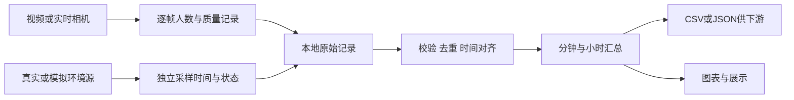

# 人员识别、数据采集与交付推进计划

更新日期：2026-09-19；状态：代码与资料已核查，下一阶段待实施。  
项目：`D:\Projects\people_counter`（视觉验证）与 `D:\Projects\station-device`（装置集成）。  
首版目标：输出指定区域的可见人数、温湿度、CO₂及其时间、来源、质量状态，并让其他项目可复用。

## 1. 结论与范围

先统一检测配置、建立人工对照，再决定调参、换模型或微调。当前已有 YOLO11s 和 1280 输入配置，不能将下一步简单理解为“把模型和参数拉高”。

开发顺序为：检测可信度 → 数据可追溯 → 汇总与图表 → 交接接口 → 树莓派稳定运行。进出流量和训练列为条件性扩展；能源预测、暖通控制与全站系统仍由下游项目负责。

本次读取了三份原计划、两个项目的代码与输出表头，并检查了库版本、CPU/CUDA 状态和视频元数据。没有重跑检测、人工逐帧标注或形成新的精度评测，因此下文的阈值、规模和工期均为建议，不能作为已达到的性能。诊断图片未完成视觉复核，具体漏检成因仍须用原片确认。

## 2. 当前进展：以文件和环境为依据

| 位置 | 核查结果 | 含义 |
|---|---|---|
| `people_counter/step4_yolo11n_person.py` | YOLO11n，imgsz=640，conf=0.25，输出画框视频 | 预览采用的配置 |
| `people_counter/step5_count_csv.py` | 优先 YOLO11s、回退 YOLO11n；imgsz=1280，conf=0.40 | CSV 并非与 step4 同一实验配置 |
| 两份检测脚本 | classes=[0]；未显式传 iou/max_det；本地库默认 iou=0.7、max_det=300 | 当前是全画面 person 框数，无 ROI、跟踪及流量规则 |
| `step5_count_csv.py` | CSV 仅含 frame_idx、video_s、person_count；固定文件名以 w 模式写入 | 会覆盖上次结果，缺少来源、参数、状态和运行编号 |
| `step6_person_curve.py` | 已实现均值、最大值、曲线及最大值帧区间 | 标题仍固定写 YOLO11n；图注将首个到最后一个峰值跨段标成一个范围 |
| `station-device/sensor_demo.py` 与输出 | 已有模拟温湿度、CO₂、缺失示例和曲线 | 旧清单“只有温度”的进度已过时；不代表真实传感器已接入 |
| `station-device/device/config.json` | 标识占位，视觉/环境/上传均为 5 秒，HTTP 地址为空 | 配置骨架，不等于缓存、通信已实现 |
| 视觉环境 | Python 3.12.4；Ultralytics 8.4.155；torch 2.14.0+cpu；OpenCV 5.0.0.93 | CUDA 不可用；当前未使用 GPU |
| 本地权重 | `D:\Datasets\models\yolo11n.pt`、`yolo11s.pt` 均存在 | n/s 对照无需先下载更多模型 |
| 测试视频元数据 | test-1：576×1280、240 帧、30 FPS；test2：720×1280、562 帧、约 51.9569 FPS | 片段短；FPS 元数据不能证明恒定帧率或真实拍摄时刻 |
| 版本状态 | people_counter 已有未提交的 step5 和视频结果变更 | 属于现有工作，本次不覆盖；station-device 核查时工作区干净 |

代码注释里的“更准”“置信度提高”“4.4/10.4 FPS”等不作为本计划的验证结果。置信度较高不等于计数更准确；权重文件存在也不能证明过去某份 CSV 使用了它。

## 3. 第一问：人多时如何提高精度

### 3.1 先定义“准”，再定位错误

当前交付量是 ROI 内按约定规则可辨认的可见人数，不是身份识别、全站总人数或一天独立访客数。误差至少分为漏检、误检、同人重复框、ROI 归属错误；未来有跟踪时再单独查 ID 切换和方向错误。

先记录机位高度、俯角、分辨率、光照、距离和 ROI。调机位时关注相互遮挡、远处人的像素尺寸、逆光、模糊、反光和海报。ROI 能排除无关区域；若只在完整画面推理后过滤框，ROI 本身不会提高远处人的分辨率。需要提高有效像素时，另比较裁图后推理，并正确映射坐标和去重。

完全遮挡、画外人员无法靠抬高参数可靠恢复；若目标实际是高密度总人数，需重新评估俯视机位、分区多机位、头部检测或专门人群计数方案。多相机重叠区域不能直接相加。

### 3.2 参数不是越大越好

| 操作 | 适用问题 | 本项目建议 |
|---|---|---|
| 降低 conf | 被遮挡/小目标得分低而被过滤 | 在同一配置下比较 0.15、0.25、0.40；可能同时增加误检 |
| 提高 imgsz | 远处人缩小后细节不足 | 比较 640、960、1280；1280 已在 step5 中使用，不保证继续增大有收益 |
| YOLO11n → s | 小模型表达能力不足 | 本地已有 s；先固定尺寸和阈值比较，再考虑 m |
| 调整 NMS iou | 邻近人物框互相抑制，或同人重复框 | 当前 YOLO11 可比较 0.60/0.70/0.80；提高值通常保留更多重叠框，也可能增加重复 |
| 提高 max_det | 输出数量确实触及上限 | 当前默认 300；十几或几十人漏检通常不是该项造成 |
| 分块/SAHI | 大画面里的远处小目标仍难检 | 第二轮候选；需要重叠区合并和端到端速度评估 |
| ByteTrack | 短暂漏检造成轨迹断裂、需要进出事件 | 不是检测精度的替代品，也不能将失联预测框无区别计入“可见人数” |
| 使用 GPU/NCNN | 推理慢、实时性不够 | 主要改善速度；不等于消除遮挡，也不保证预测完全一致 |

参数语义已与[官方 Predict 文档](https://docs.ultralytics.com/modes/predict/)及本地默认配置核对。YOLO11 大小型号见[模型文档](https://docs.ultralytics.com/models/yolo11/)；分块推理参考[SAHI 指南](https://docs.ultralytics.com/guides/sahi-tiled-inference/)。其他架构可能不用同样的 NMS 流程，不能把 YOLO11 的调法直接套到所有新模型。

### 3.3 建立可复现的小评测，而不是反复凭画面感觉调参

1. 保留现有短片，补固定机位的空场、少人、多人交错、远处小人和逆光/暗光片段；记录来源和使用范围。
2. 从多个独立片段按场景抽取 100–200 帧作起步检查。不要从同一秒连续抽上百张当作充分覆盖；单独保留未参与调参的片段。
3. 统一人工规则：ROI 用框底边中心作为初始归属点；坐姿、遮挡、边界情况写成标注例子。脚点不可靠时统一改规则并升级 ROI/规则版本。记录 frame_idx、时间、manual_count、难度、无法判定原因。
4. 主表计算 MAE=平均 |预测人数−人工人数|；Bias=平均(预测−人工)，负值表示总体偏少；再报绝对误差 P95、空场误报比例、密集场景指标和样本数。
5. 人数相同可能是漏一个又多框一个抵消。在代表性难帧上补 person 框标注，做一对一匹配计算 precision/recall；需要时再报 mAP。只有人数标注时不能声称得到检测召回率或 mAP。
6. 记录端到端 FPS、每帧推理耗时、P95 处理延迟和内存；同一设备、输入和显示/保存开关比较。树莓派另测，电脑结果不能替代。
7. 在验证片段选配置，最后在留出的独立片段验证。后续需要微调时按录像/日期/机位成组划分训练、验证、测试，避免相邻帧泄漏。

起步对照表（建议，不是已运行结果）：

| 编号 | 模型 | imgsz | conf | iou | 目的 |
|---|---|---:|---:|---:|---|
| A | YOLO11n | 640 | 0.25 | 0.70 | 对应 step4 检测配置的基线 |
| B | YOLO11s | 640 | 0.25 | 0.70 | 相对 A 只改模型 |
| C | YOLO11s | 960 | 0.25 | 0.70 | 相对 B 只改尺寸 |
| D | YOLO11s | 1280 | 0.25 | 0.70 | 相对 C 只改尺寸 |
| E | YOLO11s | 1280 | 0.40 | 0.70 | 对应当前 step5 参数，核实是否漏人更明显 |
| F | 上述选定模型 | 选定尺寸 | 0.15/0.25/0.40 | 0.70 | 局部查阈值；与既有组合重合则复用 |
| G（按需） | 选定模型 | 选定尺寸 | 选定阈值 | 0.60/0.70/0.80 | 仅在发现相邻框抑制/重复问题时做 |

共同使用 classes=[0]、相同视频帧、相同 ROI、显式 max_det=300、相同设备。初筛只跑抽样帧；入选配置再跑完整短片检查时间稳定性。不要一开始在 CPU 上跑整个大网格。

**何时微调**：机位、画质和预训练模型对照完成后，目标场景仍反复出现可标注的漏检/误检，且独立评测未达双方约定门槛，才启动。可先规划 500–1500 张多样场景帧作为首轮预算，覆盖空场负样本和困难样本；这是工作量建议，不是充分性保证。用预训练权重微调，依据学习曲线补数据，不从零训练。参考[训练](https://docs.ultralytics.com/modes/train/)与[验证文档](https://docs.ultralytics.com/modes/val/)。

**何时换更大模型**：s 在相同条件下仍不足时，用 m 作离线上限参考；只有收益和部署速度都满足再选用。不因型号更新自动升级依赖。

### 3.4 第一批代码待办（本次仅列计划）

- P0：让画框与计数调用同一个检测函数、同一份配置，显式选择权重；评测时模型缺失就报错，不静默回退。
- P0：命令行显式接收视频、输出目录、模型、imgsz/conf/iou/max_det、device 与 ROI；禁止评测时自动挑“第一个视频”。
- P0：每次运行独立 run_id；保存实际生效配置、依赖版本、模型哈希和视频标识，图与 CSV 使用同一 run_id。
- P0：改进时间轴。当前帧先加 1 再除 FPS，第一帧从 1/FPS 开始；恒定帧率约定可改为从 0 开始。变帧率优先用解码器提供且经检查的逐帧 PTS；FPS 推算需标 estimated，未知 FPS 不默认为真实 30。
- P0：在曲线中分别标注每个峰值区间；遇到缺帧/坏行检查原始帧号与时间间隔，不按删行后的列表相邻性跨断档连接。模型标题读取 manifest。
- P1：区分正常 EOF、读取错误、人工提前退出，并在 manifest 保存 run_status 和实际覆盖时段。空场成功检测=0；读帧/推理失败=null+状态。
- P1：将速度和质量字段落盘；保存抽样框及失败帧引用，以便复核，而不是只保留“最后一个人数”。

## 4. 第二问：如何收集数据

### 4.1 按三层组织，原始结果可追溯



先在电脑保留按 run_id 分开的 CSV 和 manifest；集成到装置后用 SQLite 做本地持久记录和待上传队列，CSV/JSON 作为导出和接口。上传失败不能阻塞采集；成功落库后才进入待发送流程，定期做容量检查。

建议目录，尚未全部建立：

```text
D:\Datasets\raw_videos\station\       原视频，保留来源与拍摄信息
D:\Datasets\frames\station\           标注与复核帧
D:\Datasets\models\                   权重
D:\Datasets\derived\station\          较大的结果视频、长期数据库归档
D:\Projects\people_counter\
  configs\                            评测配置（待建）
  outputs\<run_id>\                   小规模评测表、manifest、报告（待建）
D:\Projects\station-device\
  device\                             采集、记录、上传模块
  docs\                               数据字典、接口、安装/运行说明（待建）
  outputs\<run_id>\                   原始导出、聚合表、图表和交接包（待建）
```

继续遵守 D 盘规范：新代码在现有项目内增加，超过 100 MB 的视频/数据/权重放 Datasets；不移动软件目录、不复制虚拟环境。每次运行避免覆盖历史结果；数据库增长时有轮转与归档策略。保留一个带明确 simulated 标记的小样例供接口演示。

### 4.2 原始数据字典：先做到最小可用

| 表/文件 | 必须记录的内容 | 关键约定 |
|---|---|---|
| run_manifest.json | run_id、schema_version、创建时间、软件版本/提交与 dirty 状态、视频标识/哈希、模型名/哈希、完整参数、设备、ROI版本、时间依据、完成状态 | 离线数据来源标 video_inference；相机实时标 camera_inference |
| vision_frames.csv / vision_samples 表 | run_id、video_id、frame_idx、video_time_s、capture_ts、processed_ts、device_id、zone_id、people_visible_raw、status、inference_ms、端到端延迟 | 每个成功处理帧都保存，包括零人；capture_ts 不可靠就 null |
| detections.jsonl / detections 表（复核用） | 帧关联键、框坐标、class_id、confidence、是否在 ROI、track_id（可空） | 说明坐标单位及相对完整图/裁图；默认只保存选定帧，控制体积 |
| sensor_samples 表 | sample_id、device_id、sensor_id、zone_id、sample_ts、温/湿/CO₂值与单位、各通道状态、source | 每个传感器自己的采样时间；模拟值始终 source=simulated |
| device_health 表 | 时间、clock_status、连续运行时长、CPU温度/内存（可用时）、磁盘空间、上传积压、错误/丢帧数 | 健康异常不伪装为“没人” |
| outbox 表 | message_id、device_id、boot_id、seq、不可变payload、确认状态、次数、下次重试时间 | 消息唯一键与原始样本键分开；重发同一消息不分配新唯一键 |

离线帧主键采用 (run_id, video_id, frame_idx)；实时视觉样本可用 (device_id, boot_id, vision_seq)。一个上传包可以引用多个来源样本，不能因每 5 秒重发同一环境值而制造多条“新采样”。

JSON 缺失写 null，CSV 缺失用空字段，数据库用 NULL；同时保存 missing/stale/read_error/inference_error 等状态。数值 0 仅表示有效零值。confidence 是模型输出分数，不能当作已校准正确概率或直接当作设备精度。

### 4.3 时间与采样

- 离线分析使用视频时间轴。没有可信拍摄开始时间时，capture_ts 保持 null，禁止用处理当天的时钟补成“采集时间”；processed_ts 独立保存。
- 实时采集使用带时区的时间戳，建议传输统一 UTC、页面显示 Asia/Shanghai；保留单调时间/启动序号供校时异常检查。
- 先保留旧配置的视觉 5 秒、上传 5 秒作为兼容参考；另评测视觉每 1 秒更新作为人数趋势候选。实际写入的时间和有效覆盖必须反映设备能力，不能把目标周期当成达成周期。
- 检测、记录、上传分开调度；环境以驱动“有新数据”为准，CO₂/温湿度分别保留采样时间和年龄，重复读旧值不刷新来源时间。
- 跟踪与进出统计另立连续帧率要求，不沿用 5 秒抽一帧；异步实时输入丢帧/排队策略必须记录。
- 环境与视觉对齐只使用同一场地、可验证的同一时段。实时特征用向后查找最近有效样本并限制 age；过期为 null，不能用未来读数补实时值。
- CO₂响应有滞后；历史录像与今天的模拟环境值只能演示接口，不能据此分析人流与环境关系或节能效果。

## 5. 应该计算哪些参数，如何处理

### 5.1 先选这些指标

| 指标 | 算法/单位 | 用途与限制 |
|---|---|---|
| 当前可见人数 | 最新有效 ROI 计数，人；同时给 age_s/status | 实时展示；过期显示“数据过期”，不显示为当前值 |
| 分钟平均人数 | 有效时间加权平均，人 | 供能耗/负荷模型做占用特征；不是整数也正常 |
| 分钟最大值/P95 | 原始有效计数的最大值；按时间权重的 P95，人 | 保留尖峰与典型高占用；说明窗口和有效覆盖 |
| 高峰时间段 | 见下方阈值/持续时间规则 | 用于值守/展示，不能只找单帧最大值 |
| 超阈值时长 | 有效时间内 N>=H 的累计秒数或分钟数 | H 必须有配置和用途说明，不暗示法定容量 |
| 人·分钟 | sum(N_i × 有效持续秒数_i)/60 | 区域可见占用量积分；不是到访人数或进出人次 |
| 人数变化率 | 相邻有效分钟平均人数差/时间差，人/分钟 | 反映增长下降；差分不等于进入/离开人次 |
| 数据覆盖率 | 有效覆盖时长/窗口时长；另报最长缺口 | 与所有统计一起交付，避免缺测导致假低谷 |
| 环境分钟特征 | 温湿度/CO₂的有效均值、极值、样本数、年龄与状态 | 仅真实同期样本可用于实测结论，分通道质量控制 |

只在需求明确后增加：进入/离开人次、短期轨迹驻留时间、分区空间分布。密度“人/平方米”需先标定可用地面面积和 ROI 覆盖，不能拿图像像素面积代替。轨迹驻留只代表可观测且连续关联的时段，ID 断裂和跨镜头会造成偏差。

### 5.2 推荐处理规则

1. **原始层不改写**：保留原计数；去重、排时序、校验范围/状态生成清洗层。异常跳变先标记并复核，不能因为变化大就删除真实高峰。
2. **有效时间定义**：不规则采样时，计数可按前值保持到下一次样本，最长不超过配置的 max_hold_s。遇到明确无效样本即终止有效段；跨断档不延长。示例 max_hold_s=3×目标周期须另验证，不能无限前向填充。
3. **按 [start,end) 窗口聚合**：例如 1 分钟、5 分钟、1 小时。将各有效段与窗口取交集，sum(N×dt)/sum(dt) 得有效时段均值；人·分钟为 sum(N×dt)/60，缺失部分不补算。覆盖率不足时结果标 low_coverage。
4. **覆盖门槛先用 90% 作试运行候选**，报告中明确未最终验收；仍导出实际覆盖率、原始数据和缺口。无有效数据的窗口指标为 null，不能输出零均值。
5. **平滑单独存列**：可试 5 秒因果滚动中位数，people_visible_raw 永久保留；窗口内数据太少或有大断档则不计算。平滑会延迟变化、削弱短峰，不能用平滑后曲线冒充检测准确率提升。
6. **高峰事件规则版本化**：例如平滑人数达到 H 且连续保持 30 秒才进入事件，降至 L（L<H）并持续 15 秒才退出；这是建议的去抖/回差规则，H/L 需按场景确认。记录起止、持续、区间最大值、coverage 和规则版本。
7. **区分发生时间与确认时间**：持续条件在后来确认时，可回溯记录该段开始时间；实时通知不能假装更早已知。缺测中断确认并标记不完整事件，不跨长缺口合并。
8. **温度、湿度、CO₂分单位分析**：展示可共享横轴、分子图；不要把摄氏度和百分比当成同一物理量混合平均。
9. **跨日/机位/ROI/模型版本比较留痕**：计数口径变化会制造假趋势，版本变更时标分界；对照验证后才能拼接长期序列。

分钟特征导出至少包含：
`window_start, window_end, device_id, zone_id, source, run_id, model_version, roi_version, aggregation_version, n_mean, n_max, n_p95, person_minutes, above_threshold_seconds, vision_coverage, max_gap_s, temperature_c_mean, rh_pct_mean, co2_ppm_mean, environment_source, environment_coverage, status`。

若视觉和环境来源不同，分别标记，不能用一个“真实”标签掩盖模拟环境量。temperature/rh/co2 的覆盖率正式实现时分别建字段，避免一项缺失导致其余通道被误判。

## 6. 第三问：如何让其他项目接得住、让展示可信

### 6.1 交接的是数据包，不只是截图

首版生成一个按日期/运行编号命名的交接目录：

```text
handoff_<run_id>/
  README.md                 这批数据来自哪里、时段、用法与限制
  data_dictionary.md        字段/单位/时间/缺失/计数口径
  manifest.json             来源、模型、配置、版本、哈希、生成方式
  data/vision_frames.csv    原始人数记录或其受控存放引用
  data/features_1min.csv    下游直接可读的分钟特征
  data/events.csv           持续高峰事件（尚未实现时不伪造）
  quality_report.md         人工对照、分场景误差、覆盖、失败条件
  figures/                  PNG 演示图 + SVG 可编辑矢量图
  examples/sample.json      明确标记 simulated 的接口样例
  reproduce.md              使用哪个脚本/配置/版本重新生成
```

原始视频按约定保留和访问，不默认随交接包传播。正式实现时补齐导出脚本和参数；表中列出的文件目前为交付设计，不代表已经生成。

| 接收方 | 给什么 | 接收后如何用 |
|---|---|---|
| 能源/暖通研究人员 | features_1min.csv、质量字段、ROI/时间说明 | 作为占用特征与真实能耗/运行数据关联；预测和控制由对方验证 |
| 后端开发 | JSON Schema、sample.json、字段字典、幂等键、错误和补传规则 | 读取或接收数据后校验、去重、持久化 |
| 导师/汇报 | 4 张关键图、1 页当前结果与限制、短演示 | 解释能做什么、在哪些条件下有效、还有哪些缺口 |
| 后续维护人员 | 环境锁定、配置、启动命令、模型/数据引用、故障与恢复说明 | 按说明复现，不靠口头记忆 |

建议 4 张图：①人数原始/平滑/分钟均值与缺失区间；②人工人数与模型误差（按密度分组）；③分钟均值/峰值和持续高峰事件；④同时间轴的真实人数、温湿度与 CO₂分子图。数据不够时只出已有图，不拼接成虚构全天客流；长期积累后再加日期×时刻热力图。

每张图标明区域、观察时段、人数口径、模型/运行编号、数据来源及覆盖率。保留绘图源表与脚本；PNG 用于展示、SVG 用于后续排版。平均人数可为小数，原始人数为非负整数。

### 6.2 接口先小后稳

先用本地 HTTP 接收端验证一条 JSON；默认沿用原计划的 HTTP，对方已有 MQTT 才按其协议接入。不同时搭两套通信栈，不在接口尚未确认时建设复杂平台。

消息至少有 schema_version、device_id、zone_id、boot_id、seq，以及各来源样本 ID、采集时间、值、来源、质量、模型/ROI版本。接收端按 (device_id,boot_id,seq) 去重；成功持久化后确认，重传同一消息保留原键与原时间。版本变化按约定兼容或显式拒绝。

验收：离线可采集；服务恢复能补传；“接收成功但响应丢失”重发也只保存一次；重启仍可恢复队列；乱序补传不覆盖较新的当前值；故障和过期可见。未发送的数据不能为腾空间而静默删除，容量不足需告警并按明确归档策略处理。

后续演示页面只需显示最新人数、今日已观测峰值、持续高峰、温湿度/CO₂、数据更新时间和健康状态，再提供时间筛选、曲线和导出。先由本地表/接口驱动，再决定用 Streamlit 或接项目组前端。

## 7. 分阶段待办与验收

时间按个人约每日 2–3 小时的建议工作量安排，不构成截止承诺；采集和标注可能增加时间。硬件未到可先完成 P0–P3 的电脑端内容。

| 阶段 | 建议工作量 | 具体动作 | 可验收产物 |
|---|---|---|---|
| P0 固定现状 | 1 天 | 统一检测入口/配置、明确输入、独立运行目录、manifest、修正时间及图注 | 同次画框视频与 CSV 可逐帧对应；历史输出保留 |
| P1 找到有效配置 | 2–4 天 | 多场景 100–200 帧人工标注、A–F 对照、必要时 G、独立片段复核 | 人工表、对照表、分场景 MAE/Bias、代表性漏检/误检与速度 |
| P2 建记录和汇总 | 2–3 天 | 在 station-device 加 recorder、时间/来源/状态校验、分钟聚合、SQLite | 原始表、分钟表、缺失不为零，能追到来源 |
| P3 做交接样例 | 1–2 天 | 数据字典、JSON 样例、4 类可用图、交接包和复现说明 | 另一人独立读懂并画出人数趋势；未具备图显式注明 |
| P4 通信与硬件 | 硬件/接口就绪后 | 本地 HTTP、补传去重、相机与探头逐项接入、Pi 部署基准 | 真实联合数据、断网与重启日志、2h→8h→24h稳定运行 |
| P5 条件性增强 | 达到触发条件才排 | ByteTrack/进出事件、分块、微调、加速器 | 每项都有相对基线收益、额外成本和独立测试 |

模块安排建议：视觉实验仍在 people_counter；经验证的检测逻辑接入 station-device 的 device/people_counter.py，新增 recorder.py、aggregate.py、exporter.py、uploader.py、main.py；评测与报告脚本单独放 scripts。避免两套检测逻辑长期各自漂移。

P1 的最终门槛需要机位小样本结果和项目组用途共同确定，不能预写“准确率 95%”。门槛至少覆盖空场误报、多人场景 MAE/Bias、允许计数误差、更新/延迟、有效覆盖。通过后锁定配置；未通过先按错误类型改进，不以曲线更平滑作为通过证据。

Pi 端建立独立环境，比较轻量模型及 NCNN 的实际端到端性能；格式转换后重新检查计数误差。官方[树莓派部署指南](https://docs.ultralytics.com/guides/raspberry-pi/)仅作方法参考，其基准不代表本机位、分辨率和软件版本。

## 8. 当前下一步清单

- [ ] 明确这次看到多人漏检的是 step4、step5 预览还是命令行 runs 结果，并记录其确切配置。
- [ ] 选定代表性拥挤片段与 ROI；补少人、空场和困难场景；写下人工计数规则。
- [ ] 新增统一配置和独立输出机制，再开始 A–F 比较；先不覆盖或重跑旧文件。
- [ ] 建人工对照表，报告密集场景 MAE/Bias 和误检/漏检类型。
- [ ] 选出“电脑离线分析”候选配置；Pi 配置保持待测。
- [ ] 将录像计数接入装置记录结构，构建分钟特征和交接样例。
- [ ] 向项目组确认 ROI/机位、是否必须进出流量、CSV/HTTP/MQTT、更新周期及误差门槛。
- [ ] 仅在既定触发条件满足时安排训练或加速硬件。

首个应交付的小结果：同一批人工标注帧上的参数对照表 + 一个可追溯 run_id 数据包。这比立即开始训练更能回答“人多时到底哪里出错、下一笔时间应该花在哪里”。

## 9. 依据与原计划的关系

本计划补充软件验证、数据处理和交接细节，保留原实施计划 V3 的装置交付边界。原 Flow 中 ByteTrack/IN-OUT 的学习步骤按实际业务需求启用，不作为首版人数趋势的必需前置项。

本地依据：

- [高铁站房嵌入式感知装置实施计划 V3](C:/Users/jieti/outputs/researchwrite/station-energy-control/exports/高铁站房嵌入式感知装置实施计划.md)
- [装置软件配置与学习清单](C:/Users/jieti/outputs/researchwrite/station-energy-control/exports/装置软件配置与学习清单.md)
- [嵌入式感知装置开发资料与排障 Flow](C:/Users/jieti/outputs/researchwrite/station-energy-control/exports/嵌入式感知装置开发资料与排障Flow.md)
- [视觉检测](../people_counter/step4_yolo11n_person.py)、[人数记录](../people_counter/step5_count_csv.py)、[人数绘图](../people_counter/step6_person_curve.py)
- [装置配置](device/config.json)、[模拟环境示例](sensor_demo.py)

补充技术依据：[Ultralytics 跟踪说明](https://docs.ultralytics.com/modes/track/)（检测阈值应与跟踪阈值共同考虑，进入关联前已过滤的框无法再恢复）。在线资料查阅日期为 2026-09-19；实际实验以记录的本地软件版本为准。

